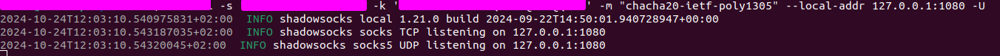
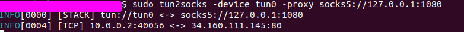

# Configure Shadowsocks Client on Ubuntu

Shadowsocks is a popular option for building secure tunnels with masked traffic. It's simple and lightweight. Unlike other similar tools like WireGuard or OpenVPN, Shadowsocks lacks a well-organized development process. This means there is no centralized documentation, multiple versions exist, and client configuration can be tricky.

## Server

Setting up the server is quite simple. Below is a sample Docker Compose file. You’ll need to install Docker to use it.

```yaml
version: "2.1"
services:
  shadowsocks:
    image: shadowsocks/shadowsocks-libev:v3.3.5
    container_name: shadowsocks
    ports:
      - 8388:8388
      - 8388:8388/udp
    environment:
      - METHOD=chacha20-ietf-poly1305
      - PASSWORD=your_password
    restart: always
```

## Client

The Shadowsocks client works as a local proxy, meaning you configure and connect it to your remote server, but locally it is exposed as an HTTP or SOCKS5 proxy.

- **Windows**: There is a nice GUI client that allows you to set a global proxy with a single click. I found it to be almost as good as the WireGuard client. However, some applications ignore system proxy configurations, so their traffic may bypass the tunnel.
- **Android**: The client experience is also smooth—one client, and all traffic is wrapped.
- **Ubuntu**: While there are plenty of clients, I couldn't find one that works like WireGuard. You’ll need to configure each app individually, and in some cases, it may be impossible.
- **macOS/iOS**: I haven’t checked yet =)

## Configuring Shadowsocks to Wrap All Traffic on Ubuntu

A proper solution for Ubuntu is to use Shadowsocks in combination with a tool like `tun2socks`, which streams your traffic from a network adapter to the local Shadowsocks proxy. Let’s configure this combination.

First, install the following tools:

- [tun2socks](https://github.com/xjasonlyu/tun2socks)
- [Shadowsocks](https://github.com/shadowsocks/shadowsocks-rust)

I downloaded the binaries from the release pages and moved them to `/usr/bin`.

Assuming you have a server running as configured above, we will use the `sslocal` binary. Your client command will look like this:

```bash
sslocal -s "shadowsocks_server:shadowsocks_port" -k "your_password" -m "chacha20-ietf-poly1305" --local-addr 127.0.0.1:1080 -U
```

The output should look something like this:



Now, you can test the client with `curl`:

```bash
curl --proxy "127.0.0.1:1080" "https://ifconfig.me"
```

It should return the IP address of your remote Shadowsocks server.

Next, you need to create a local network adapter and route all traffic through it. Then, use `tun2socks` to direct traffic from that adapter to the Shadowsocks tunnel.

Create the network adapter with the following commands:

```bash
ip tuntap add mode tun tun0
ip addr add 10.0.0.2/24 dev tun0
ip link set dev tun0 up
```

Run `tun2socks` with:

```bash
tun2socks -device tun0 -proxy socks5://127.0.0.1:1080
```

You can check if it works with:

```bash
curl --interface tun0 http://ifconfig.me
```

The output should be your Shadowsocks server's IP address.

Proper `tun2socks` output looks like this:



Now, let's route your traffic through the **tun0** network interface and exclude traffic going to the Shadowsocks server. Otherwise, it will create a loop.

First, obtain your gateway address and outer interface name:

```bash
# gateway IP address
ip route | grep default | awk '{print $3}'
# outer interface
ip route | grep default | awk '{print $5}'
```

Next, configure the traffic routing:

```bash
ip route add "shadowsocks_server_ip" via "gateway_ip" dev "outer_interface"
ip rule add to "shadowsocks_server_ip" lookup main priority 1000
```

The last command might cause issues. If something goes wrong, you may end up without internet access. Here are commands to route traffic to the tunnel and to revert it if needed:

- To route traffic to the tunnel:  
```bash
ip route add default dev tun0 table 100
```

- To revert the routing:  
```bash
ip route delete default dev tun0 table 100
```

If everything works fine, you can open a browser and visit [iplocation.net](https://www.iplocation.net). It should show the location of your Shadowsocks server. You can also test it with:

```bash
curl "https://ifconfig.me"
```
