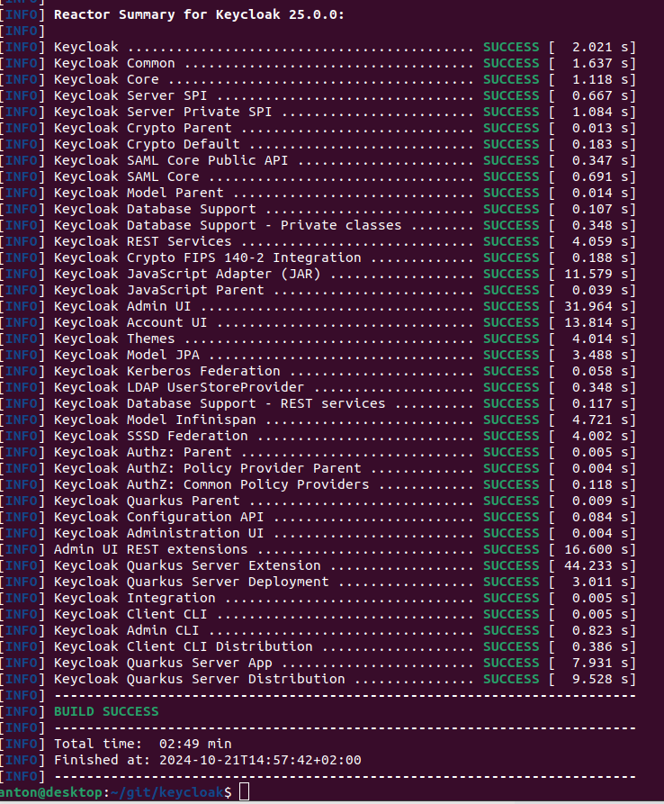
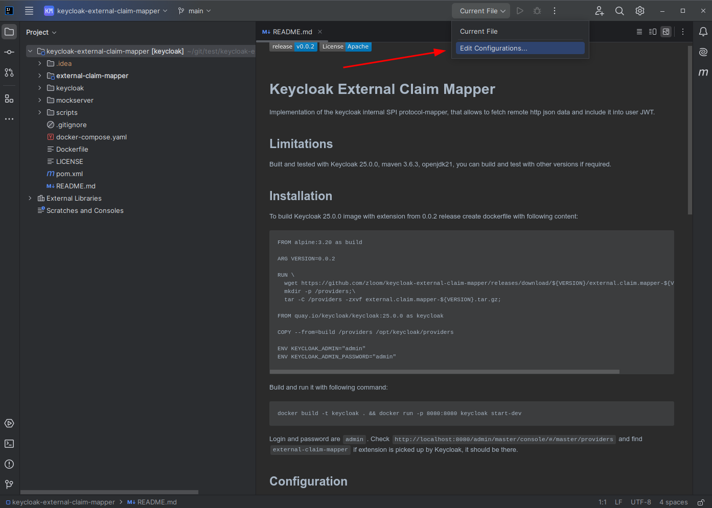
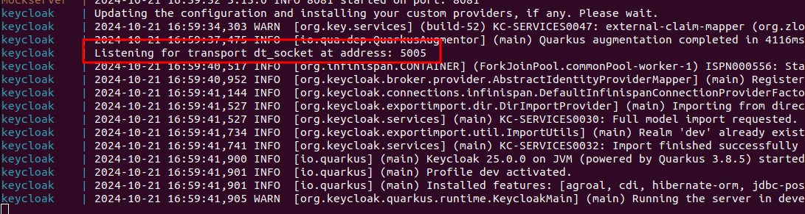
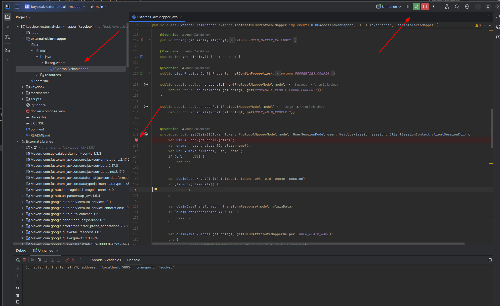

# Debugging Keycloak Extension

It’s hard to understand how your code will behave just by looking at it. To do it properly, you’d have to run it in your head. This becomes especially challenging with complex codebases like Keycloak. Instead of manually analyzing the source code or reading through the documentation, it makes sense to spend some time setting up a debugger and walking through the execution path.

## Tools and Codebase

In this example, I’m going to use IntelliJ IDEA as my Java IDE and Docker Desktop for running Keycloak. Here are the tools you will need:

- [Docker Desktop](https://www.docker.com/products/docker-desktop)
- [IntelliJ IDEA](https://www.jetbrains.com/idea/download)
- Maven and JDK 21 (or newer)
- [Keycloak codebase](https://github.com/keycloak/keycloak)
- [Example extension codebase](https://github.com/zloom/keycloak-external-claim-mapper)

Download and install the tools, and clone the repositories to your local environment. Follow the official installation guides. You will also need to build Keycloak by following the official instructions [here](https://github.com/keycloak/keycloak/blob/main/docs/building.md). In this guide, I will be using Keycloak 25.0.0, so before building, check out the correct version with the command:  
`git checkout tags/25.0.0`.

Keycloak runs tests during the build process, but you can skip them with the following command:  
`./mvnw -pl quarkus/deployment,quarkus/dist -am -DskipTests clean install`.

We need the local Keycloak build because it will allow us to navigate through not only the extension sources but also the Keycloak code itself.

  
The Keycloak build took 2:49 minutes in my case ;-)

## Configuration and Running

Open IntelliJ and load the project folder. Since this project uses Maven as the build tool, IntelliJ will rely on `.pom` files. On the IntelliJ welcome screen, click "Open" and choose `keycloak-external-claim-mapper`.



You need to add a debug profile:

1. Click **Edit Configuration** as shown in the screenshot above.
2. Click "Add," and choose **Remote JVM Debug**.
3. Set **Use module classpath** to **external-claim-mapper**.

Now, let’s run Keycloak with the sample extension. Open the `keycloak-external-claim-mapper` folder and run the following terminal command:  
`docker compose up --build`.  
You should see logs from all three containers: Keycloak, Postgres, and MockServer. The following logs indicate that Keycloak is running in debug mode:



The following configuration manages debug mode in Keycloak, and you can find it in the Dockerfile:

```dockerfile
ENV DEBUG='true'        # Debug mode on/off
ENV DEBUG_SUSPEND='n'   # Wait for debugger connection at startup; useful when stepping through startup code
ENV DEBUG_PORT='*:5005' # Debugger port; this should be mapped to localhost

```
## Debugging with Breakpoints

To start debugging, you need to attach the debugger, set breakpoints, and trigger code execution. Let’s attach IntelliJ to the Keycloak instance running in Docker. To do that, hit the "Attach" button in the top-right corner or press the `Shift+F9` shortcut.

To set a breakpoint, open `keycloak-external-claim-mapper/external-claim-mapper/src/main/java/org/zloom/ExternalClaimMapper.java`, click on line 141, and press the `Ctrl+F8` shortcut.



To trigger code execution, mappers are executed during token generation, so you need to request a user token from the endpoint. Below is the curl command:

```bash
curl 'http://localhost:8080/realms/dev/protocol/openid-connect/token'  \
  -H 'Content-Type: application/x-www-form-urlencoded' \
  --data-urlencode 'client_id=account' \
  --data-urlencode 'grant_type=password' \
  --data-urlencode 'username=test' \
  --data-urlencode 'password=test'
```
If everything is set up correctly, you should be able to step through your extension code with all variables available in the call stack. There’s also an evaluation tool, allowing you to test certain functions without needing to rebuild.

You can debug not only the extension but also Keycloak itself. It’s not always easy to find where the HTTP requests enter the codebase. To do this, open the Keycloak source code and search for `@POST` or `@GET`. Among the results, one relevant file is TokenEndpoint.java. If you set a breakpoint here, you can walk through all steps of the Keycloak token generation process, which is very useful when setting up features like token exchange.
